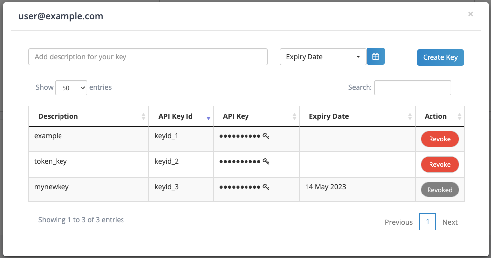
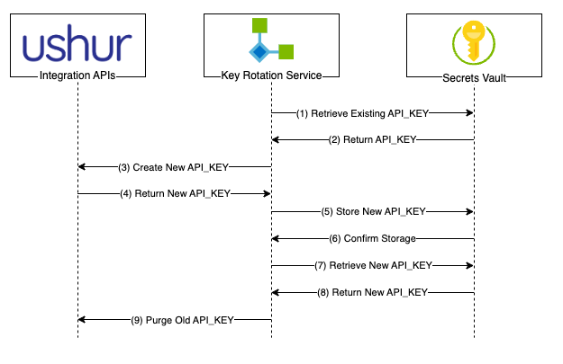

# Ushur API Key Renewal
As a best practice, API keys should be rotated frequently. Ushur provides the ability to create keys with expiration dates, as well as revoke active keys. This document will show you how to automatically rotate your keys using the Ushur REST APIs with little to no interruption to your end users.

# Key Management Best Practices
Before we get into it, we should ensure that there are baseline best practices incorporated into your key management policies.
1. Even if it's automatic, this procedure should be executed during a maintenance window, or period of low system usage.
2. Rotate Keys about 2 weeks before they expire. This gives you time to deal with any issues with rotation.
3. If you're revoking keys, also do this after you've tested the configuration of your new key.
4. Your new keys should be stored in an (encrypted vault)[https://geekflare.com/secret-management-software/]

# Key Management Process
Rotating your keys will follow the process outlined in the following sequence diagram:

The diagram assumes that you're also already using a Secrets Vault to store and retrieve your `API_KEY` for use in your integrating application.

# Full example in (renew-apikey.ipynb)[renew-apikey.ipynb]